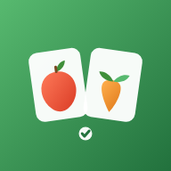

# 🍎🥕 จับคู่ผัก & ผลไม้ — Veggie & Fruit Match

เกมเปิดการ์ดจับคู่ (memory game) ผักและผลไม้ **เน้นเล่นบนมือถือ** พร้อมเรียนคำศัพท์ไทย–อังกฤษ
เขียนด้วย HTML + CSS + JavaScript ล้วน ๆ **ไม่มี dependency ไม่ต้อง build**

<p align="center">
  
</p>

## เล่นยังไง

1. เลือก **ระดับความยาก** (ง่าย 12 ใบ · ปกติ 16 ใบ · ยาก 20 ใบ · โหด 24 ใบ)
2. เลือก **หมวด** ที่จะเล่น — ผสม / ผลไม้เท่านั้น / ผักเท่านั้น
3. แตะการ์ดสองใบให้เป็นภาพเดียวกัน ถ้าตรงกันการ์ดจะติดอยู่และขึ้นชื่อ **ไทย · อังกฤษ** ให้จำ
4. จับคู่ครบทุกใบให้เร็วที่สุดโดยเปิดการ์ดน้อยครั้งที่สุด — สถิติดีที่สุดจะถูกบันทึกไว้ในเครื่อง

## วิธีรัน

เปิดไฟล์ `index.html` ด้วยเบราว์เซอร์ก็เล่นได้ทันที แต่ถ้าอยากได้ความสามารถ PWA
(ติดตั้งเป็นแอป + เล่นออฟไลน์) ต้องเสิร์ฟผ่าน http:

```bash
python3 -m http.server 8000
# แล้วเปิด http://localhost:8000
```

จากมือถือในวง Wi-Fi เดียวกัน เปิด `http://<ไอพีเครื่อง>:8000` แล้วเลือก
"เพิ่มไปยังหน้าจอโฮม" / "ติดตั้งแอป" ได้เลย

> ℹ️ `service worker` ลงทะเบียนได้เฉพาะ `http`/`https` — ถ้าเปิดตรง ๆ ผ่าน `file://`
> เกมยังเล่นได้ปกติ เพียงแต่ไม่มีความสามารถออฟไลน์

## สิ่งที่ใส่ใจเป็นพิเศษสำหรับมือถือ

- กระดานถูกคำนวณให้ **พอดีหนึ่งหน้าจอทุกระดับความยาก** ไม่ต้องเลื่อนหาการ์ด (ทดสอบถึงจอกว้าง 320px)
- การ์ดใหญ่กว่า 44px เสมอ — กดด้วยนิ้วโป้งได้แม่น
- ใช้ `pointerdown` + `touch-action: manipulation` → ไม่มีดีเลย์ 300ms ไม่มีการซูมเวลาแตะเร็ว
- `100dvh` + `safe-area-inset` → ไม่ถูก notch หรือแถบล่างบัง, ปิด pull-to-refresh กลางเกม
- แอนิเมชันพลิกการ์ดใช้ `transform` (GPU) และเคารพ `prefers-reduced-motion`
- รองรับธีมมืดอัตโนมัติตามระบบ
- เสียงสังเคราะห์ด้วย Web Audio (ไม่มีไฟล์เสียงให้โหลด) + สั่นด้วย `navigator.vibrate`
  ปิดได้ทั้งคู่จากปุ่มเดียว และไม่พังบนเครื่องที่ไม่รองรับการสั่น (เช่น iOS)

## โครงสร้างไฟล์

| ไฟล์ | หน้าที่ |
|---|---|
| `index.html` | ตัวเกมทั้งหมด — markup, สไตล์, และตรรกะเกม อยู่ในไฟล์เดียว |
| `manifest.webmanifest` | ข้อมูลแอปสำหรับติดตั้ง (ชื่อ, สี, ไอคอน, เปิดแบบ standalone) |
| `sw.js` | service worker แบบ cache-first เพื่อเล่นออฟไลน์ |
| `icons/` | ไอคอนแอป (SVG ต้นฉบับ + PNG 192/512 + maskable) |

## เพิ่มผัก/ผลไม้ใหม่

แก้ที่ตัวแปร `FOODS` ใน `index.html` ที่เดียว (ประมาณต้นแท็ก `<script>`):

```js
const FOODS = [
  { emoji: '🍎', th: 'แอปเปิล', en: 'Apple', kind: 'fruit' },
  { emoji: '🥬', th: 'ผักกาดขาว', en: 'Cabbage', kind: 'vegetable' },
  // เพิ่มบรรทัดใหม่ต่อท้ายได้เลย — kind ใช้ได้เฉพาะ 'fruit' หรือ 'vegetable'
];
```

เกมจะสุ่มหยิบจากรายการนี้ตามจำนวนคู่ของระดับที่เลือก ดังนั้นแต่ละหมวด
(`fruit` / `vegetable`) ควรมีอย่างน้อย 12 รายการ เพื่อให้เล่นระดับ "โหด" แบบหมวดเดียวได้

ปรับจำนวนการ์ดต่อระดับได้ที่ตัวแปร `LEVELS` (`pairs` = จำนวนคู่, `cols` = จำนวนคอลัมน์)

## หมายเหตุเรื่องภาพ

ใช้อิโมจิเป็นภาพผัก/ผลไม้ จึงคมทุกความละเอียดและไม่ต้องโหลดรูปเลย
หน้าตาอิโมจิจะต่างกันเล็กน้อยตามระบบปฏิบัติการ (iOS / Android / Windows)
